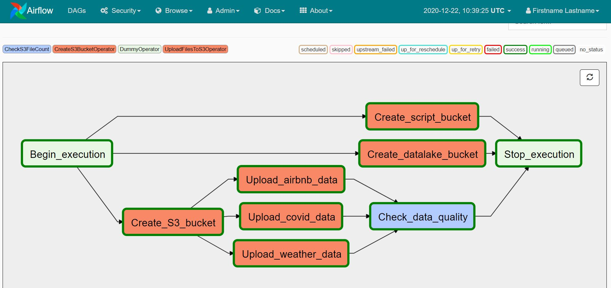
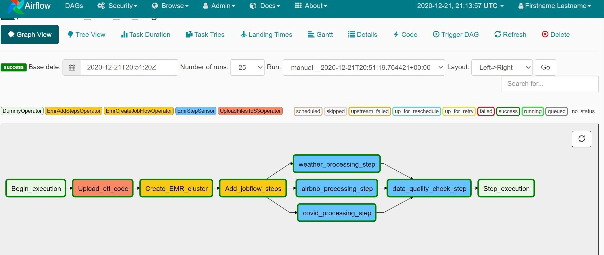

# Data Engineering NanoDegree Capstone Project
### How Bad Are Covid-19 Pandemic Effects On Airbnb ?

### Project Summary
Airbnb has successfully revolutionized the traditional hospitality industry as more and more travelers choose Airbnb as their primary hosting provider. Since its beginning in 2008, Airbnb has seen an enormous growth, with the number of rentals listed on its website growing exponentially each year.

Paris has the largest number of Airbnb listings than any other city in the world.
More than **52,000** listings, and **86%** of them entire homes, while in almost the same period that Airbnb has been active in Paris, it has been estimated that about **20,000** apartments have disappeared from the traditional rental market.

In the past couple months, the Covid-19 pandemic have shut down the travel industry. And suddenly Airbnb is facing an existential crisis

So what could possibly go wrong and how the Covid-19 pandemic impacted On Airbnb?


### Project Structure

```
Udacity-DEND-Capstone-Project
│   README.md                                    # Project description
│   requirements.txt                             # Python dependencies
│   docker-compose.yml                           # Docker Containers Configuration
|   
└───notebooks                                    # Python notebooks to run ETL locally
|   | ETL_airbnb.ipynb                           
|   | ETL_covid.ipynb                            
|   | ETL_weather.ipynb                          
|___data
|   |
│   └───airbnb_paris_data                        # Airbnb Data Directory     
│   |   └─── listings.csv                             
│   |   └─── reviews.csv                         
│   └───covid19_data                             # Covid-19 Data Directory      
│   |   └─── confirmed_data.csv                          
│   |   └─── deaths_data.csv                     
│   |   └─── recovered_data.csv                  
│   └───weather_data                             # Weather Data Directory 
│       └─── weather_paris.json   
|   
|___assets
│       └───raw_datalake_dag_graph_view.JPG     # Move data to s3 DAG Graph View
│       └───airbnb_etl_dag_graph_view.JPG       # Airbnb data etl DAG Graph View
|   
|___src 
|   |
│   └───airflow                                 # Airflow home
│   │    │─── dags                              # DAG definitions
│   │    │     └─── dag_airbnb_data_etl.py      # Airbnb data etl DAG
│   │    │     └─── dag_move_data_to_s3.py      # Move data to s3 DAG
│   │    │─── plugins                           
│   │    │     └─── operators                   # Custom operators
│   │    │     │     └─── create_s3_bucket.py   # CreateS3BucketOperator
│   │    │     │     └─── data_quality.py       # CheckS3FileCountOperator 
│   │    │     │     └─── upload_file_s3.py     # UploadFilesToS3Operator
│   └─── download_data_script                   
│   │    └─── covid_data_download.py            # Python script to download covid-19 data
│   │    └─── weather_data_download.py          # Python script to download weather data
│   └─── script                                 
│   │    └─── airbnb_etl.py                     # Airbnb data etl script
│   │    └─── covid_etl.py                      # covid data etl script
│   │    └─── weather_etl.py                    # weather data etl script
│   │    └─── check_data_quality.py             # Check data quality script
│   └─── emr                                    
│   │    └─── emr_config.json                   # EMR cluster configuration
```


### Requirements for running locally
* Install [Python3](https://www.python.org/downloads/) and [Jupyter](https://jupyter.org/)
* Install [Docker](https://www.docker.com/) and [Docker Compose](https://docs.docker.com/compose/install/)
* Create an [AWS](https://aws.amazon.com/) Account and make sure to create an [IAM Role](https://docs.aws.amazon.com/IAM/latest/UserGuide/id_roles.html)


### Step 1: Scope the Project
### Scope
The idea is to create a **Data Lake** on AWS, enabling users to analyze covid-19 effect on airbnb  data and extract insights.
The main goal of this project is to build an end-to-end data pipeline which is capable to work with big volumes of data. We are going to extract, transform and load the data to an optimized data lake on S3. The data lake will consist of logical tables partitioned by year and month to optimize query latency.


### Technologies
The datasets will be cleaned, enriched to add more information and will be loaded into a data lake. For this, we will use following tools and technologies:

<b> 1. AWS S3: </b>
 - Amazon S3, is is an object storage service that offers industry-leading scalability, availability and durability. We are going to use Amazon S3 to :
   - Store the raw data
   - Create a data lake 

<b> 2. AWS EMR: </b>
 - We are going to use Apache Spark running on an EMR cluster on AWS to ingest the data from S3 and perform the ETL process, denormalizing the datasets to create the data lake.

<b> 3. Apache Airflow: </b>
 - We are going to build a data pipeline using Apache Airflow to orchestrate everything. Airflow provides an intuitive UI where we can track the progress and bottlenecks of our pipelines.

<b> 4. Python: </b>
 - Python is a easy to use programming language as it supports wide variety of libraries to perform tasks such as creation of pipelines as well as data analysis.

<b> 5. Docker: </b>
 - Docker is a tool designed to make it easier to create, deploy, and run applications by using containers. Containers allow a developer to package up an application with all of the parts it needs, such as libraries and other dependencies, and deploy it as one package.


### Describe and Gather Data
We are going to work with 3 data sources:

- [Airbnb Data](http://insideairbnb.com/get-the-data.html)
    - **Inside Airbnb** is an independent, non-commercial set of tools and data that allows you to explore how Airbnb is really being used in cities around the world.
    - We are going to use Paris Data by downloading 2 datasets:
        - Detailed Listings data for Paris. (66 336 records, CSV)
        - Detailed Review Data for listings in Paris. (1 261 965 records, CSV)
- [Covid-19 Data](https://github.com/CSSEGISandData/COVID-19/tree/master/csse_covid_19_data/csse_covid_19_time_series)
    - This dataset contains information about COVID-19 daily time series summary tables, including confirmed, deaths and recovered
- [Weather Data](https://dev.meteostat.net/python/daily.html#example)
    - This dataset contains daily weather information, and we are going to use meteostat API in order to download it in JSON Format.


### Step 2: Explore and Assess the Data

**Airbnb Data**

One of the biggest issues with Airbnb data is getting the occupancy rate for each host or listing. [Inside Airbnb](http://insideairbnb.com), our data source, uses an occupancy model which they call the ["San Francisco Model"](http://insideairbnb.com/about.html#disclaimers) with the following methodology:

1. A Review Rate of 50% is used to convert reviews to estimated bookings, it means that only 50% of all visitors write a review. With that said, the number of reviews  divided by the review gives us an estimate of actual visitors.
2. An average length of stay for each city is usually published by Airbnb. This number multiplied by the estimated bookings for each listing over a period of time gives the occupancy rate.
3. Finally, the estimated income is occupancy rate multiplied by the price

So for the fact revenue table we have to add two calculated fields:
- Occupancy Rate = Average Length of Stay * (reviews count/ Review Rate)
- Estimated Income = Occupancy Rate* Price

**Covid-19 Data**

For covid-19 data, since the downloaded files includes all contries, we start by filtering to get only france data, then we transpose columns to rows and finally join the 3 files togther.  

**Weather Data**

The weather dataset includes some unnecessary columns and will be removed.

### Step 3: Define the Data Model
#### Data lake schema
<b> Fact table <b>
1. revenue table
    
| Column Name | Data Type| Description|
|-------------|:---------:|-------------|
| date| DateType| The date
| listing_id| int|Unique id of listing|
| host_id| int| Unique id of host|
| occupancy| float| Calculated occupancy rate|
| income_est| float| Estimated income|
| year| int| The year
| month| int|The month
| day| int| The day

    
<b> Dimension tables <b>
1. host table

| Column Name| Data Type| Description|
|-------------|:---------:|-------------|
| host_id| int| Unique id of host, Primary Key|
| host_name| string| Host name|
| host_location| string| Host location|
| host_since| DateType| Date when host started using airbnb|
| host_response_time| string| Host response time|
| host_response_rate| string| Host response time|
| host_is_superhost| string| Whether host is superhost or not|
| host_acceptance_rate| string| Host acceptance rate|

2. listing table


| Column Name| Data Type| Description|
|-------------|:---------:|-------------|
| id_listing| int|unique id of listing, Primary Key|
| name| string| listing name|
| description| string| listing description|
| price| string| listing price|
| neighbourhood_group_cleansed| string| listing neighbourhood group|
| latitude| float| listing latitude|
| longitude| float| listing longitude|
| property_type| int| listing type|
| accommodates| int| listing accommodates|
| bathrooms| int| number of bathrooms |
| bedrooms| int| number of bedrooms |
| beds| int| number of beds |
    
4. covid table

| Column Name| Data Type| Description|
|-------------|:---------:|-------------|
| date| DateType| The date|
| confirmed| int| Number of confirmed cases|
| deaths| int| Number of deaths |
| recovered| int| Number of recovered |
| year| int| The year|
| month| int| The month|
| day| int| The day|


5. weather table


| Column Name| Data Type| Description|
|-------------|:---------:|-------------|
| date| DateType| The date|
| tavg| float| The average air temperature in °C|
| tmin| float| The minimum air temperature in °C|
| tmax| float| The maximum air temperature in °C|
| year| int| The year|
| month| int| The month|
| day| int| The day|
    
6. date table


| Column Name| Data Type| Description|
|-------------|:---------:|-------------|
| date| DateType| The date|
| year| int| The year|
| month| int| The month|
| day| int| The day|
| weekday| int| The weekday|


### Step 4: Run ETL to Model the Data
#### Clone repository to local machine
```
git clone https://github.com/amine-akrout/Udacity-DEND-Capstone-Project.git
```

#### Change directory to local repository
```
cd Udacity-DEND-Capstone-Project
```

#### Create python virtual environment
```
python3 -m venv venv             # create virtualenv
source venv/bin/activate         # activate virtualenv
pip install -r requirements.txt  # install requirements
```

#### Download and get the data
- Airbnb Data:
Download and save the data in the folder `data/airbnb_paris_data/`
- Covid-19 Data:
Use the script covid_data_download.py to automatically download covid data and save it in csv format
    
```
cd src/download_data_script
python covid_data_download.py
```
- Weather Data:
Use the script `weather_data_download.py` to automatically download weather data using meteostat [API](https://dev.meteostat.net/python/daily.html#example)  and save it in JSON format
    
```
python covid_data_download.py
```


#### Start Airflow Container
We are going to use [Bitnami image](https://github.com/bitnami/bitnami-docker-airflow) for the airflow container
```
cd ../..
docker-compose up
```

#### Start Ariflow UI
Access [localhost:8080](http://localhost:8080) in your browser and login to Airflow.

* Username: user
* Password: password
    
#### Configure Airflow
-  **Airflow connections**
    
    Navigate to *Admin* >> *Connections* >> *Add a new record*, then enter the following values :
        - Conn Id: Enter aws_credentials.
        - Conn Type: Enter Amazon Web Services.
        - Login: Enter your Access key ID from the IAM User credentials.
        - Password: Enter your Secret access key from the IAM User credentials.
        - Extra: Add the default region name. { "region_name": "eu-west-3" }


-  **EMR config**
    
    Navigate to *Admin* >> *Connections*, Select the 'emr_default' connection.
    
    Copy everything from `src/emr/emr_config.json` and paste it in the field 'Extra' then save.

    
    
#### Start move data to s3 DAG

Navigate the Airflow UI and start the `move_data_to_s3_dag` by switching it state from `OFF` to `ON`
Refresh the page and click on the **trigger dag** button.

Navigate to *Graph View* to view the current DAG state.
This pipeline creates the 3 S3 buckets,one for our raw data, the second for our data lake and a 3rd bucket for our scripts, and uploads the data from local machine.
Wait until the pipeline has successfully completed (it should take around 5-10 minutes).


    
 | Step | Type | Description |
| --- | --- | --- |
| Begin_execution | DummyOperator | Dummy task with no action |
| Create_S3_bucket,<br/>Create_script_bucket,<br/>Create_datalake_bucket | CreateS3BucketOperator |  Creates S3 bucket |
| Upload_weather_data,<br/>Upload_covid_data, <br/>Upload_airbnb_data | UploadFilesToS3Operator | Move data from local to s3 bucket|
| Check_data_quality | CheckS3FileCount | Check wether the were uploaded or not |
| Stop_execution | DummyOperator | Dummy task with no action |


#### Start airbnb data etl DAG
Navigate back to the Airflow UI and start the `airbnb_data_etl_dag` by switching it state from `OFF` to `ON`
Refresh the page and click on the **trigger dag** button.

Navigate to "Graph View" to view the current DAG state.

This pipeline extracts the data from raw data bucket, transforms it with Spark cluster on EMR to create dimension and fact tables and writes it back to S3 in a data lake.

 | Step | Type | Description |
| --- | --- | --- |
| Begin_execution | DummyOperator | Dummy task with no action |
| Upload_etl_code | UploadFilesToS3Operator | Upload etl scripts to S3 |
| Create_EMR_cluster | EmrCreateJobFlowOperator | Creates an EMR Cluster |
| Add_jobflow_steps | EmrAddStepsOperator | Adds steps to an existing EMR JobFlow|
| weather_processing_step,<br/>covid_processing_step,<br/>airbnb_processing_step,<br/>data_quality_check_step | EmrStepSensor | Asks for the state of the step until it reaches a terminal state. If it fails the sensor errors, failing th|
| Stop_execution | DummyOperator | Dummy task with no action |


### Step 5: Complete Project Write Up


## Addressing Other Scenarios
**1. The data was increased by 100x**
    
- The raw data storage and data lake would not require significant changes since we have a flexible schema and S3 is meant for storing big data.
- For the ETL job, we should propbably use m5large or m5xlarge for EC2 instances insted of m4large and add more workers


**2. The pipelines would be run on a daily basis by 7 am every day.**
    
We could schedule Airflow pipelines so that they run on a daily basis at 7 am


**3. The database needed to be accessed by 100+ people.**
    - We would need more CPU resources to get a fast experience, we should use a distributed datawarehouse solution like Redshift, in order to improve replications and partitioning to get faster query results for each user.